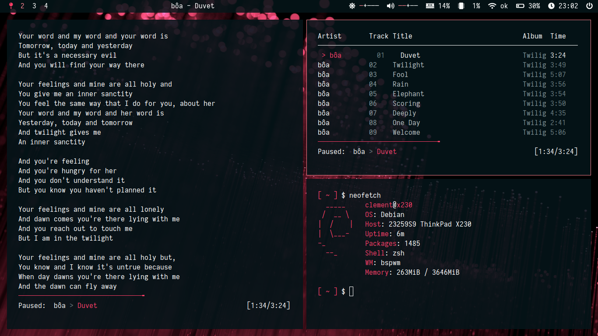

# My personal dotfiles

My system runs on debian buster with BSPWM.

### Programs to install :
`bspwm + sxhkd, urxvt, polybar, feh, mpd + ncmpcpp + mpc, dmenu, nautilus, zsh, vim, scrot, vivaldi, neofetch, lxappearance, xbacklight, mpv`

### Preview :

ヽ(o^ ^o)ﾉ
