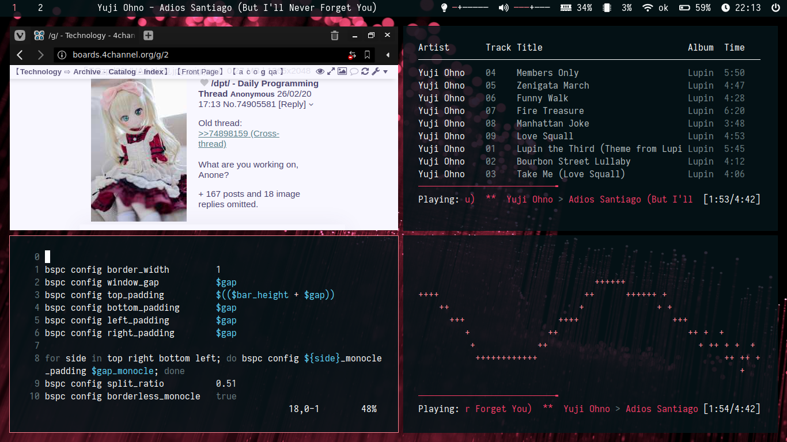

# Dotfiles for debian + bspwm

### Programs to install :
* bspwm + sxhkd
* urxvt
* polybar
* feh
* mpd + ncmpcpp + mpc
* dmenu
* nautilus
* zsh
* vim
* scrot
* vivaldi
* neofetch
* lxappearance
* xbacklight

### Scrot :

─=≡Σ((( つ＞＜)つ
