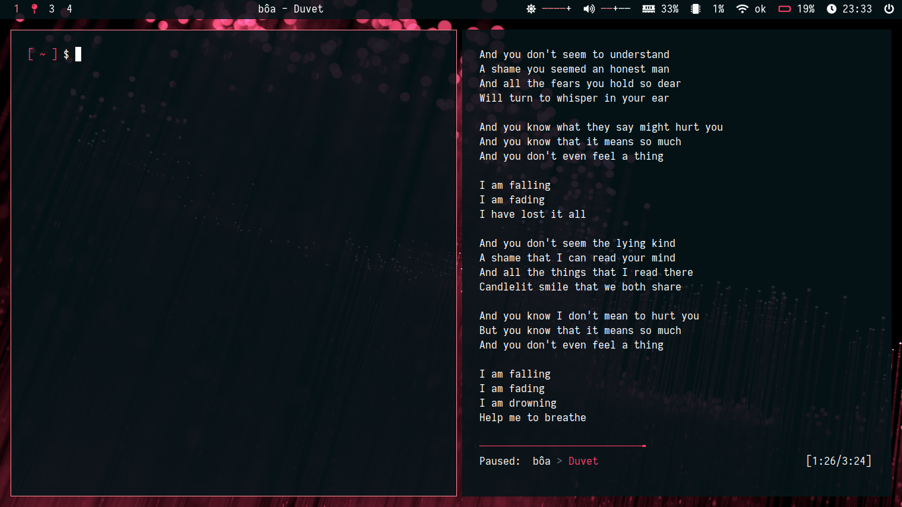

# My personal dotfiles

My system runs on Debian Buster with BSPWM.

## Programs to install :
* WM :`bspwm + sxhkd`
* Terminal : `urxvt` with `zsh`
* Bar : `polybar`
* Editor : `vim`
* Launcher: `rofi`
* Web browser : `vivaldi`
* File explorer : `nautilus`
* Media:
  * Video player : `mpv`
  * Image viewer : `feh`
  * Music player : `mpd` + `ncmpcpp` + `mpc`
  * Document viewer : `mupdf`
* Utilities : `xbacklight`, `scrot`, `neofetch`, `lxappearance`

## Preview :

ヽ(o^ ^o)ﾉ
